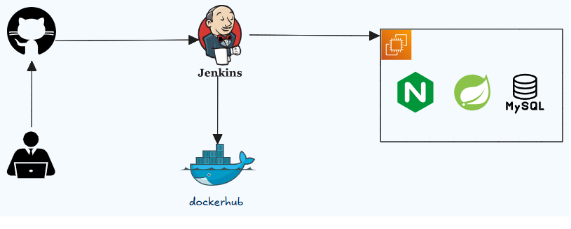
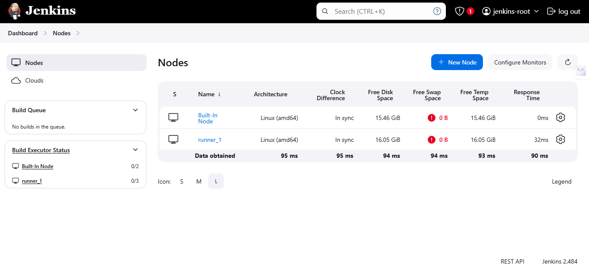
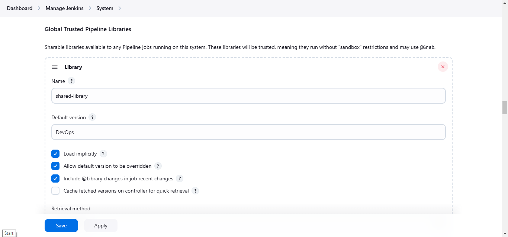
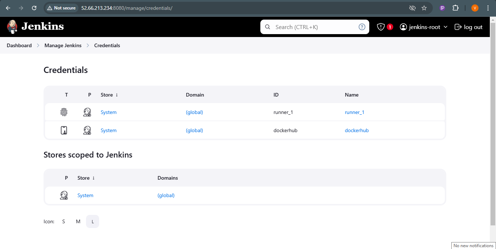
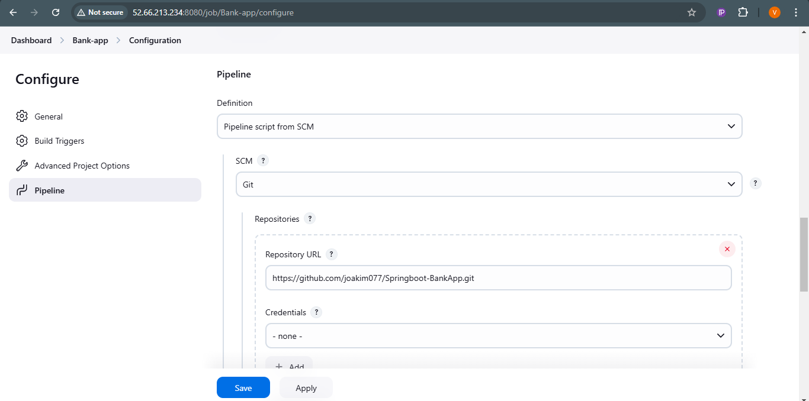

#### CICD Workflow
- Cloning the Project code from GitHub.
- Build docker image and push it to docker hub.
- Pull image from docker hub and deploy application using docker compose .

    
#### Creating CICD pipeline 

 1. #### Install Jenkins and access on port 8080
    ```bash 
        http://<Instance_IP>:8080
        # Development environment only
        http://<Instance_IP>:8080
        
        # Production environment (recommended)
        # Access through reverse proxy with HTTPS
        https://<your-domain>/jenkins
     ```
    Login and install Suggested Plugins.

2. #### Jenkins Configuration.
    - SetUp Agent
        - Agents are used for distribute the builds in parallel execution
        

        - Install Docker and docker-compose:V2 on worker node and add the user who is executing the Jenkins job into the docker group. because we are going to deploy application in worker node itself.

        **Note**    Security Considerations for Docker Setup. When configuring Docker for Jenkins:

        - Avoid adding the Jenkins user to the Docker group, as it grants root-level access.
        - Use Rootless Docker to run Docker daemons and containers without root privileges. [Official Guide](https://docs.docker.com/engine/security/rootless/).
        - Configure sudo for Docker commands:
        - Grant specific permissions in the sudoers file.
        - Use sudo in your pipeline scripts to execute Docker commands.
        - Implement access control mechanisms using Docker authorization plugins or socket proxies.

        

    - Configure Shared Library
        - Configure the task effectively in centralized manner.
        -  Configure shared library for your Jenkins Server Navigate through Dashboard > Manage Jenkins > System, and add Global Trusted Pipeline Libraries. (Modern SCM)

        


    - Configure Crendentials.
        - Credentials that are requied during job execution. 
        - e.g. DockerHub credentials for push and pull images.
        
        

3. #### Create a Pipeline, Execute Job and Configure Webhook
 
    - Configure Pipeline.
        - Configure job to get pipeline from SCM.
        
    - Build Job and Check
        - Build the Job
    - Configure WebHook and poll SCM.
        - Webhook Configuration       

            1. **Install GitHub Plugin**
            - Go to `Manage Jenkins > Manage Plugins > Available`.
            - Search for **GitHub Integration Plugin**, install, and restart Jenkins if needed.

            2. **Configure Jenkins Job**
            - In job configuration, enable **GitHub hook trigger for GITScm polling** under **Build Triggers**.

            3. **Set Up Webhook in GitHub**
            - Go to `Repository > Settings > Webhooks > Add webhook`.
            - Configure:
                - **Payload URL**: `http://<your-jenkins-server>:8080/github-webhook/`
                - **Content type**: `application/json`
                - **Events**: Select **push** or others as needed.
            - (Optional) Add a secret token for security.

            4. **Test Webhook**
            - Push changes to the repo and verify the job is triggered.
            - Check webhook status under **Recent Deliveries** in GitHub.

        - SCM Polling Configuration 

            1. **Enable SCM Polling**
            - In job configuration, select **Poll SCM** under **Build Triggers**.
            - Add a cron expression in **Schedule**:
                - Every 5 minutes: `H/5 * * * *`
                - Every 15 minutes: `H/15 * * * *`

            2. **Test Polling**
            - Push changes to the repo and wait for the next polling interval.
            - Verify in **Polling Log** under the Jenkins job dashboard.


        - Key Notes

            - **Webhooks vs Polling**:
            - Webhooks are immediate and resource-efficient.
            - Polling introduces delays and higher resource usage.

            - **Security**:
            - Use SSL/TLS for GitHub-Jenkins communication.
            - Ensure Jenkins is accessible via the firewall.

            - **Jenkins Pipeline**:
            - Ensure `Jenkinsfile` is correctly configured to check out the repo and branch.


#### Nginx and HTTPS [guide](nginx.md)