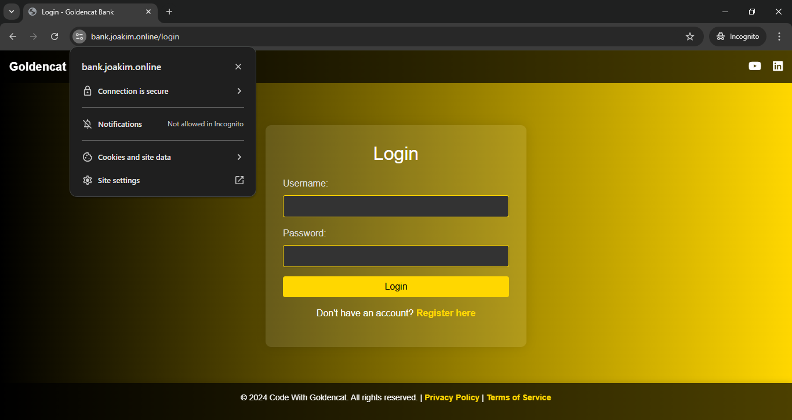

## Configure nginx as proxy server, Domain Mapping and enable SSL encryption for HTTPS.
---




### Configure nginx on your EC2.
- Install nginx
   ```bash
   sudo apt update             
   ```
-  Start nginx 
   ```bash
   sudo systemctl start nginx
   ```

- enable nginx 
    ```bash
    sudo systemctl enable nginx
    ```

- Create a new Nginx server block configuration file for our bank-app application
    ```bash
    sudo touch /etc/nginx/sites-available/bank-app
    ```

- Configure server: add the following code
   ```bash
   server {
        listen 80;
        server_name bank.joakim.online; # Replace with your domain

        location / {
            proxy_pass http://localhost:8080; # Since Bankapp is running on port 8080
            proxy_set_header Host $host;
            proxy_set_header X-Real-IP $remote_addr;
            proxy_set_header X-Forwarded-For $proxy_add_x_forwarded_for;
            proxy_set_header X-Forwarded-Proto $scheme;
        }

        location ~ /\. {
            deny all;
        }
    }
    ```

- Create a symbolic link to the configuration file in the sites-enabled directory:
    ```bash
    sudo ln -s /etc/nginx/sites-available/bank-app /etc/nginx/sites-enabled/
    ```
- Test Nginx Configuration and restart nginx if test is successful
    ```bash
    sudo nginx -t 
    sudo systemctl restart nginx
    ```
- SSL certificate to the Domain.
    ```bash
    sudo apt install python3-certbot-nginx
    ```
    ```bash
    certbot --version
    ```
    ```bash
    certbot --nginx -d bank.joakim.online
    ```
- Verify SSL setup:
    1. Check SSL certificate: `curl -vI https://bank.joakim.online`

    2. Verify automatic renewal: `sudo certbot renew --dry-run`

    3. Test HTTPS redirect: `curl -I http://bank.joakim.online`


